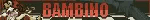
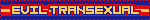
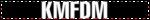
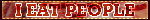

## Abandon hope all ye who enter here ...

Welcome to my page, dear reader. My name is Beladonna, I am a Romani-English fag transsexual vampire born in the late February of 1808. I use feminine pronouns. I am a Pisces sun, a Scorpio moon and an Aries rising.

I take a keen interest in body modification, riddles, macabre fiction and the grotesque intricacies of the human mind. My favourite genres of music are industrial metal, gothic rock and new wave, but I listen to everything.

I am a Yumejoshi, my husband is Franco Barbi from the video game Outlast Trials <3 I adore that disgusting freak of a man.

Involved in the Goth and alternative community from the age of 210.

## Heed my warning ...

Please do not interact with me if you involve yourself in petty internet discourse. I have no opinion on someone's identity, attraction or consumption of media.

That being said, I do not support endogenic systems. If you genuinely believe you are a system of endogenic origin, I recommend going to therapy. 

I can become defensive about my interests and favourite characters, please don't speak negatively about them in front of me.

I have OCD, BPD, ADHD and autism. I am also the host of a P-DID system. My conditions affect the way I perceive the world and interact with others.

##

       
<!--
**leatheroccult/leatheroccult** is a ✨ _special_ ✨ repository because its `README.md` (this file) appears on your GitHub profile.

Here are some ideas to get you started:

- 🔭 I’m currently working on ...
- 🌱 I’m currently learning ...
- 👯 I’m looking to collaborate on ...
- 🤔 I’m looking for help with ...
- 💬 Ask me about ...
- 📫 How to reach me: ...
- 😄 Pronouns: ...
- ⚡ Fun fact: ...
-->
